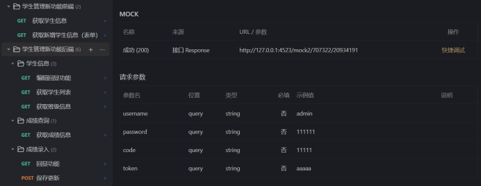
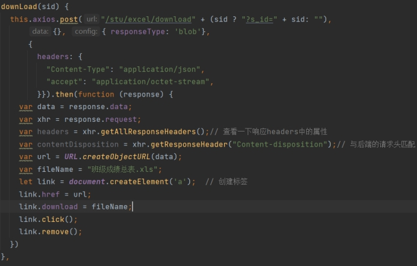
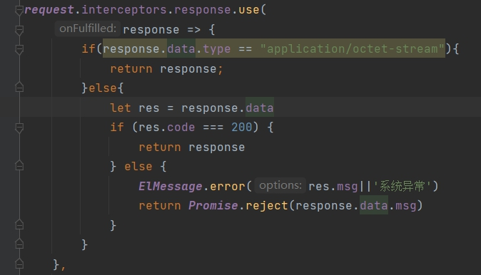
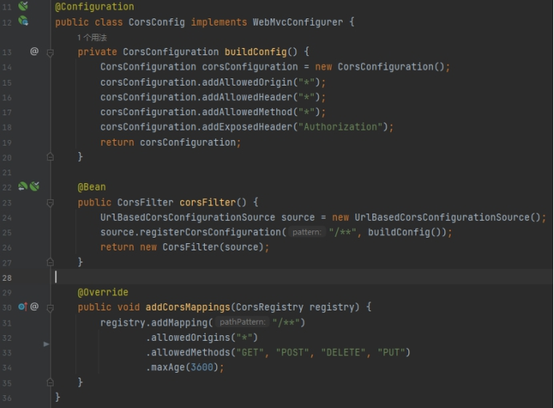
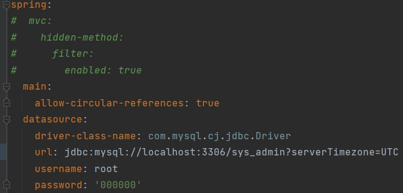
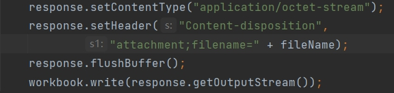
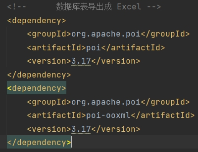
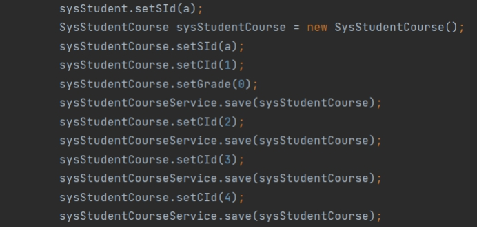
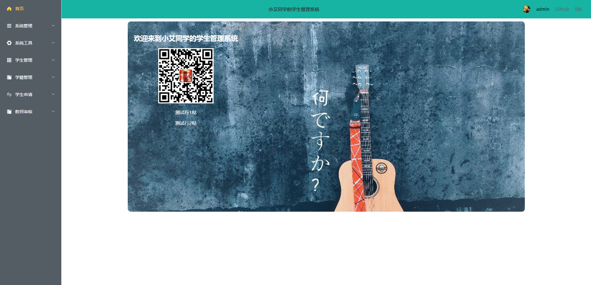

# 学生管理系统（简易教务系统）

> 写在前头：
>
> 这是为了完成HNUST综合实训1和数据库课程设计写的前后端分离项目，供大家学习参考（没有一定水平的情况下不建议直接clone，具体要求见下文详细介绍）。
>
> 代码都是手敲，但是框架并不是自己原创，而是根据B站up主Markerhub吕一鸣的项目进行二次加工，如果基础不好的同学建议可以简单了解体系架构后再进行食用，切勿盲目抄袭。

------

## 关于体系架构

前端部分：https://www.zhuawaba.com/post/18

后端部分：https://www.zhuawaba.com/post/19

B站视频：https://www.bilibili.com/video/BV1af4y1s7Wh?spm_id_from=333.999.0.0&vd_source=a81ef8427e696b92de364d833142bd10

------

## 技术栈的使用

前端：Vite+Vue3+Vue-Router+Element-Plus+axios+ECharts

后端：SpringBoot+Mybatis-Plus+Spring Security+Jwt+Redis+Mysql

中间件：Mock.js+Apifox（开发时测试用的）

部署：Linux服务器Ubuntu系统NGINX

（关于部署是在学长的教导下完成的，感谢Github——lsh学长的帮助，提供了参考文章：https://segmentfault.com/a/1190000039124639，前端使用nginx的反向代理，后端使用的是screen窗口保持项目的持续启动）

------

## 关于数据库

视频中使用的是基于MD5的BCryptPasswordEncoder加密工具，这样使得数据库中存储的用户密码不是正常登陆时的密码。

数据库中目前给了4个用户，其中admin的密码为111111，包含所有功能；test的密码为111111，仅有Markerhub教程开发的功能；2005060106密码为111111，为学生端功能；老师密码为111111，为老师端功能。

------

## 踩坑

###### 前端问题

在开发之前我了解到目前网络上的前端技术选用大多是Webpack+Vue2+Element-UI，但是实际上目前的最新的技术普遍采用Vite+Vue3+Element-Plus，视频大多是两三年前的旧技术选型。所以为了保持技术的新鲜性，以及未来引入更新潮技术时此系统能快速胜任，因此我采用的是最新的技术Vite+Vue3+Element-Plus进行开发，同时，因为与别人已经开发完备的架构不同，选用新技术势必会出现许多新问题。下面记录了一些我在开发中遇到的具有代表性的问题以及解决方法：

 

1、Vue3中使用Element-Plus与Element-UI不兼容问题：Element-UI是饿了么开发的前端组件库，主要针对的是Vue框架，但是Vue3相比Vue2有了很多改动，一些函数、方法都被弃用了，因此在使用中遇到了不少需要解决的问题。

（1）icon的使用方式：在Element-UI中icon是作为class样式引用的固定字段，但是Element-Plus中为了方便开发者自定义icon的样式，将这些字段变成了标签。因此如果需要动态传输icon的内容（比如从后端向前传）就不能使用{{}}来进行引用了，而是要把要用到的icon先从Element-Plus中提取出来，放入component中实例化后才能使用；

（2）插槽的更新：slot具名插槽和slot-scope作用域插槽在Vue3中已经被弃用，在Vue3中使用v-slot取代了原有的插槽；

（3）弹出框的更新：Element-UI的各种弹出框使用:visible.sync方法绑定属性实现弹出框的显示、隐藏，但是实际上这句话的内核还是调用的Vue里的方法，所以在Element-Plus中舍弃了这个方法，直接使用更为简单直接的v-model实现对于属性的双向绑定；

（4）关于文档的阅读：Element-Plus用的是TypeScript语法体系，所以有些地方反而使用不了，ElementUI虽然适配的是Vue2，但是使用的是JavaScript语法体系，在export default中参考ElementUI会方便很多。但是实际上TS体系比JS体系要安全方便一些，但是因为本人能力有限，在JS都不是很熟悉的情况下不敢贸然转到TS，但是值得一提的是：未来的趋势一定是TS。

 

2、Vue3中require方法的弃用：require是node.js环境下对于静态资源的一种调用方式，但是因为它属于node.js环境，所以在浏览器上实际上是不生效的。同样，如果用require请求的是图片资源的话，在后续前后端合并时会出现找不到的情况，所以取消require使用import来引用资源，同时个人建议图片等资源放到远程仓库（Github）中通过URL来使用，可以避免很多不必要的麻烦。

 

3、mock.js的使用：在还没有开发后端的情况下，对前端进行数据渲染时通常需要获取后端的数据，目前网上的教程都是教大家使用开源的mock.js去Mock数据，但是近几年有不少国内外的接口软件崭露头角，比如说postman、Apifox等。这里我使用的是Apifox向前后端发送Mock数据。

经过Mock回显的数据能够很好的了解自己传输的data格式，方便在前后端交互中对传输数据的格式进行定义修改。

 

4、关于Vite和Webpack的选用：

Webpack会先打包，然后启动开发服务器，请求服务器时直接给予打包结果。而vite是直接启动开发服务器，请求哪个模块再对该模块进行实时编译。由于现代浏览器本身就支持ES Module，会自动向依赖的Module发出请求。Vite充分利用这一点，将开发环境下的模块文件，就作为浏览器要执行的文件，而不是像Webpack那样进行打包合并。

由于vite在启动的时候不需要打包，也就意味着不需要分析模块的依赖、不需要编译，因此启动速度非常快。当浏览器请求某个模块时，再根据需要对模块内容进行编译。这种按需动态编译的方式，极大的缩减了编译时间，项目越复杂、模块越多，vite的优势越明显。

最主要也最关键的是用vite可以快速搭建vue项目，不需要像webpack一样配置诸多文件。因此虽然Webpack仍是应用较多的打包方式，但是Vite已经后来居上，展现出一种取而代之的趋势。

 

5、axios提供下载功能：

这里需要注意的是，我的axios配置了拦截器，但是文件流的传输需要设置请求头和编码格式，那么后端通过response传过来的数据就不能再放入Result格式化了（如果直接放入了就会像前端发送两次数据，虽然可以正常下载，但是前端会抛出异常），那么前端的axios过滤器就必须将文件流的response放行，如何有选择的放行就成了一个问腿：如果直接注释掉的话，那么最直接的报错就是即使前端拿到了诸如code: 400也会执行操作，这时登陆页面就会失效，虽然不会登陆成功，但是会进入系统页面。所以通过我的逐一对比，发现response.data.type是唯一的，这恰好是文件的传输格式——"application/octet-stream"。所以在axios全局过滤时将数据流为application/octet-stream的response放开，就能保证数据的正常下载。

------

###### 后端问题

1、跨域问题：和前端进行交互时会出现跨域问题，这里配置了一个CorsConfig文件传输Authorization，并配置许可实现前后端的正常交互。

 

2、Mybatis-plus配置的添加分页、防全表更新插件需要使用setUseDeprecatedExecutor(false);方法避免缓存出现问题，但是这个函数已经在最新的Mybatis-plus文档中移除了，可惜的是文档更新时间是今年的一月份，随之修改的地方有很多，包括代码生成器的生成规范都有不小的改动，因此权衡之后最后还是下调了一个版本的SpringBoot，降到2.7版本避免了这个问题。（网上暂时还没有解决办法）

 

3、循环依赖问题：在SpringBoot2.7及以上的版本又出现了组件中不能循环调用的问题，如果两个控制器分别调用里面的方法就会构成循环依赖，在SpringBoot启动时就会禁止。但是实际上并不会对系统安全构成影响（仅仅指我这个简单的系统），所以最后在yml配置文件中加上allow-circular-references: true允许存在依赖循环解决。

 

4、数据库连接：这是我碰到的最坑的问题之一，对于纯数字的数据库密码一定记得加上单引号或者双引号。因为网上大部分人进行演示的时候数据库账密一般为root/root，所以很少有人会注意到这个细节问题。根据SpringBoot的报错你能定位到是数据库的连接出了问题，但是很难看出问题的来源来自于密码的配置错误，报错如下：

Cause: org.springframework.jdbc.CannotGetJdbcConnectionException: Failed to obtain JDBC Connection; nested exception is java.sql.SQLException: Access denied for user 'root'@'localhost' (using password: YES)] with root cause.

 

5、后端配置Excel传输流：

为了操作Excel，首先需要引入poi框架，poi也是apache的一个项目，该项目主要是为Java提供操作微软的office文件的一套解决方案，也就是说poi框架的功能不光是操作excel，包括word和PowerPoint等等office办公常用格式的文件。在查阅的过程中其实有很多poi工具供大家选择，比如说EasyPoi就是个人开发者开源的简化poi操作的工具包，但是为了以后类似场景以及配合完整的开发流程，这里选用的依旧是主流的poi工具包。

配置像前端传输的流格式，配置Header信息让前端接收。

这里需要注意的是，在前后端交互时会存在跨域问题，虽然我们在前面已经配置了CorsConfig文件解决了基本的跨域问题以及配置了Authorization来传输token，但是这里需要对上图中的Content-disposition开放额外的放行。需要在CorsConfig文件中加入corsConfiguration.addExposedHeader("Content-disposition");保证前端不会发生跨域问题。

 

6、数据库插入操作的细节

我们在页面中插入数据时可能不止对一个表进行了插入，如果只对单表插入可能导致字段缺失，其他表的插入就会出现问题。

这里我遇到的问题是：我的学生信息作为单独的一张表，新增学生时只在sys_student表中执行插入功能，为了避免冲突，我的成绩表中就是查询的已有的学生信息，对于缺少的字段进行成绩为零操作。所以在成绩录入的页面我的sql语句是更新操作，那么对于新插入的学生，他的成绩字段为空，因此成绩录入就不成功。解决方法也很简单，在新建学生信息的时候将学生的成绩字段也插入即可。

------

## 总结

希望大家还是用心开发，学会了SSM/Spring Boot，未来在计算机行业打螺丝就不是啥问题了，如果想要去体验一下项目，可以参考www.fenrisx.top网站，已经部署了，但是未来可能也会过期吧，毕竟咱也是比较穷的，主要实现的功能：

也没啥好说的，能看到这的各位一定要加油啊！我要去接着卷了~ ——By Alexie-Z-Yevich 2022.6.17
